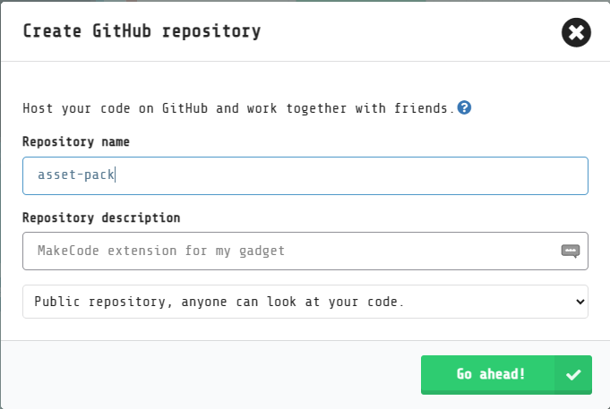
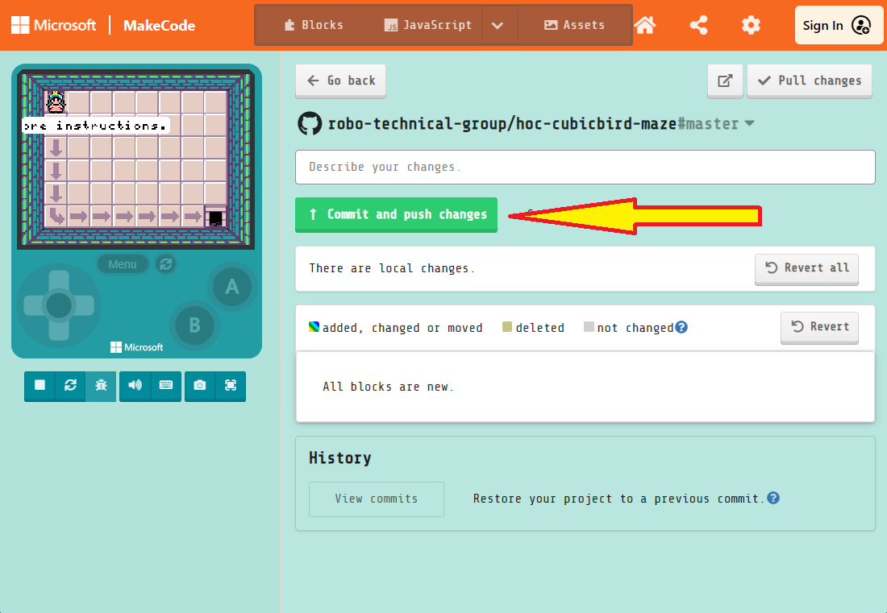

# Building a custom skillmap
# Part II: Creating an asset pack

[Video tutorial on YouTube (Thanks, Richard!)](https://youtu.be/ikz15E24F2k?si=_e3IJRTDBVqUSKFA)

In step 4 of Part I, you created the final version of the project that your students will create in your skillmap and tutorials. If your project includes custom assets (*e.g.*, backgrounds, sprite images and animations, sound effects, melodies), then you should create an *asset pack* that you can import into your tutorials. You will create that project in this article.

If your project does not contain custom assets (perhaps you want your students to customize the project with their own art), then you can skip this article.

# Create a GitHub repository for your assets

You will need to create a GitHub repository for your asset pack. There are two ways to do this: Through the MakeCode interface and through the GitHub web site.

## Option one: Use the MakeCode interface

Follow these steps to create a GitHub repository by using the MakeCode interface. The repository will be owned by your GitHub account. If you want an organization to own the repository instead, then create the repository with **option two**, below, instead.

1.   Open the MakeCode editor that you will be using in your tutorials.
1.   Create a new project. **Note**: The project name must conform to JavaScript naming rules---the name can contain only letters, underscores, and numbers; the name must start with a letter.
1.   Select the GitHub logo at the bottom of the screen to create a GitHub repository.
     
1.   Sign into GitHub if you have not done so already.
1.   Verify the name and description for your repository.
1.   Select the **Go ahead!** button.
     

Congratulations! You have created your asset pack repository and you can edit it in MakeCode!

## Option two: Use the GitHub website

Follow these steps to create a GitHub repository using their web interface. Then, you will load the empty repository into MakeCode and populate it with an initial set of files. In particular, use this option if you want an organization, rather than your personal account, to own the repository.

1.   Open the [GitHub website](https://github.com) in your favorite web browser.
1.   Switch to the appropriate organization if needed.
1.   Create a new repository.
     -   **Note**: The project name must conform to JavaScript naming rules---the name can contain only letters, underscores, and numbers; the name must start with a letter.
     -   **Also note**: The repository must be public. *Do not* create a private repository.
1.   After creating the repository, copy its Git URL.
     
1.   Open the MakeCode editor that you will be using in your tutorials.
1.   On the MakeCode home page, select the **Import** buton.
     
1.   Select the **Import URL...** option.
1.   Paste your GitHub repository's URL.
1.   Select the **Go ahead!** button.
1.   When the empty MakeCode project is created, select the GitHub button at the bottom of the screen.
     
1.   Enter a description describing your commit (*e.g.*, "Initial MakeCode Arcade files").
1.   Select the **Commit and push changes** button.
     

Congratulations! You have created your asset pack repository and you can edit it in MakeCode!

# Configure the project as an asset pack

Follow these steps to configure your project as an asset pack.

1.   Open your project in MakeCode.
1.   If the project opens in the Blocks interface, then switch to the JavaScript editor.
1.   In the project explorer beneath the simulator, open the `pxt.json` file.
1.   Select the **Edit Settings As text** button.
     
1.   Add the property in the code snippet below. A good place is beneath the `description` property. Note the comma at the end; it is important. Keep in mind that the MakeCode editor may rearrange the properties. The order in which they appear is not important.
     ```json
     "assetPack": true,
     ```
1.   Switch to the `main.ts` file in the project explorer. Your changes to `pxt.json` will be saved when you switch files.
1.   Commit and push your changes to the GitHub repo. (Refer to the instructions in **option two** above.)

Congratulations! Now, your project and its assets can be imported into tutorials.

# Add the assets for your tutorials

Now, using the tools built into the editor, add the assets needed by your tutorials.

1.   Select the **Assets** button to switch to the assets manager.
1.   Select the green button to add an asset.
     
1.   Select the type of asset that you are creating.
1.   Create the asset using the appropriate editor.
1.   Be sure to give the asset a name! Follow JavaScript naming requirements.

# Publish your new assets

Whenever you create assets in your project, you need to publish your changes using the MakeCode editor. Follow these steps to publish your changes and create a new release.

1.   Commit and push your changes to the GitHub repo. (Refer to the instructions in **option two** earlier in this article.)
1.   In the **Release zone** section, select the **Create release** button.
     

Each time you update the repository with new or updated assets, it is important to create a new release. This will help the MakeCode servers provide the most recent version of your repository to your students.

# Your assets are ready!

Congratulations! You have published a set of assets that can be used in your tutorials. Move on to Part III when you are ready to write your first tutorial.

-   [Contents](./)
-   [Part III: Writing your first tutorial](./custom-skillmap-3.html)
