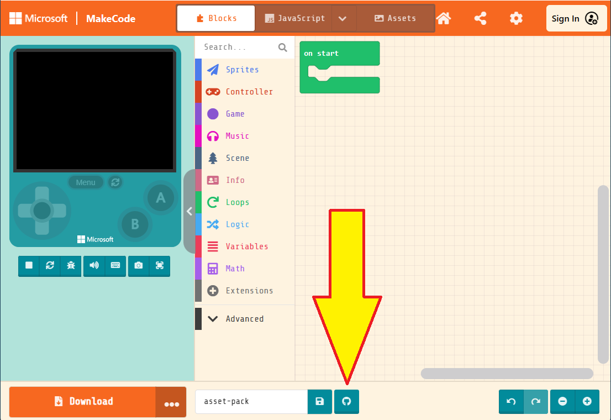
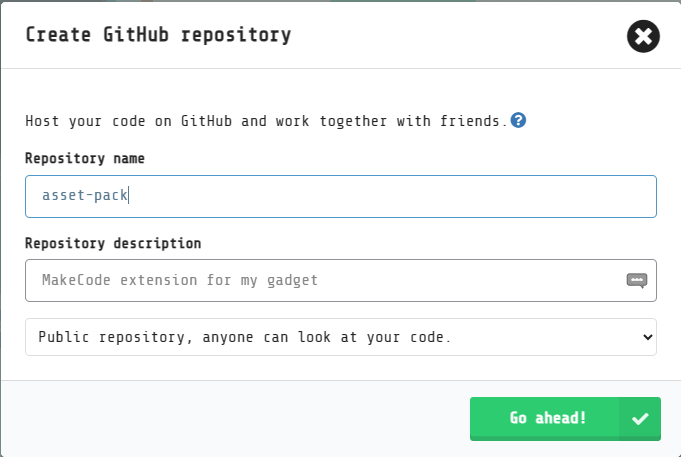
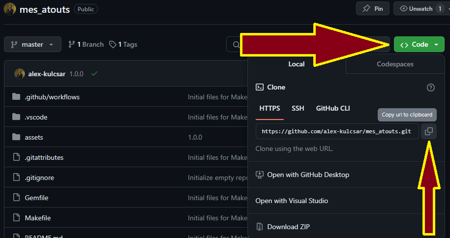
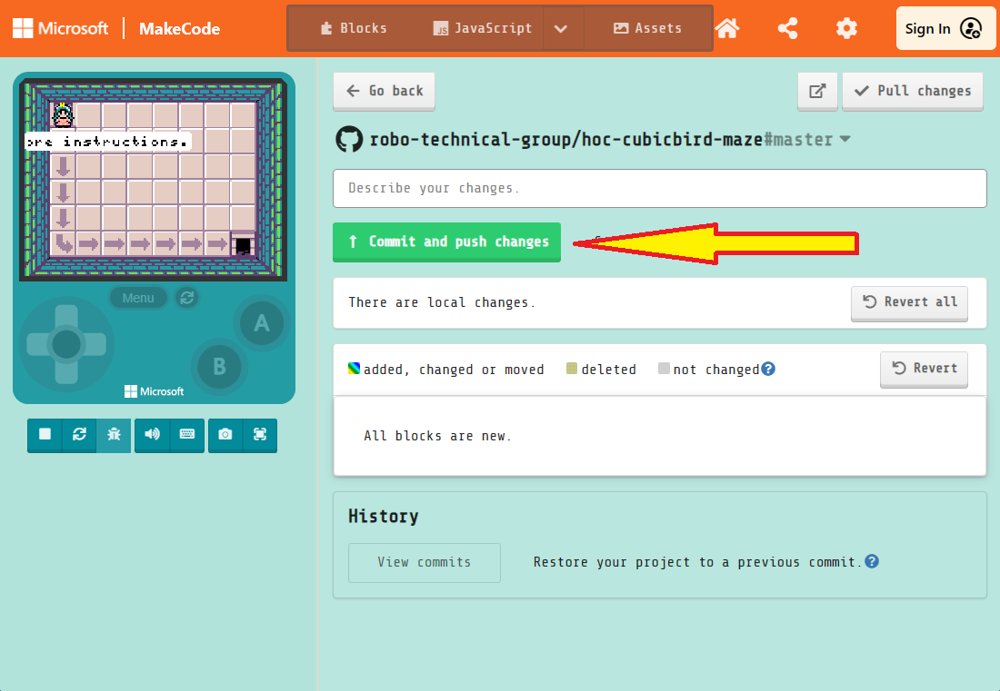
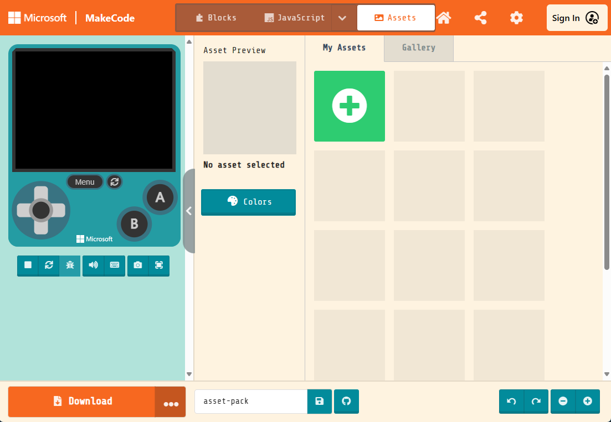
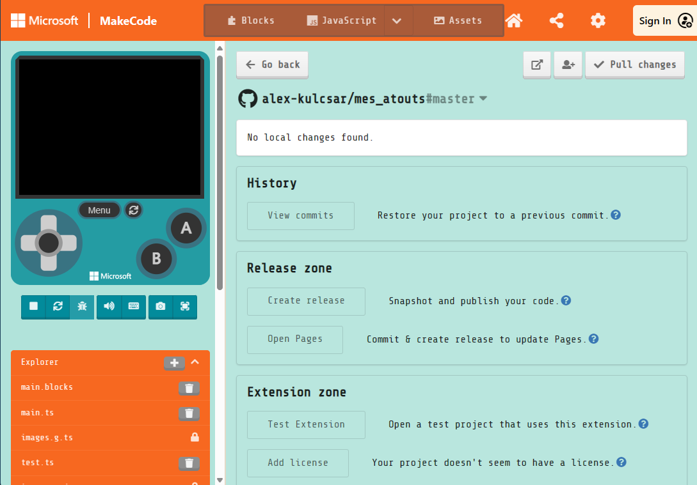

# Création d'un skillmap personnalisée
# Deuxième partie : Création d'un pack de ressources

[Tutoriel vidéo sur YouTube](https://youtu.be/ikz15E24F2k?si=_e3IJRTDBVqUSKFA)

À l'étape 4 de la première partie, vous avez créé la version finale du projet que vos élèves créeront dans votre skillmap et vos tutoriels. Si votre projet comprend des ressources personnalisées (par exemple, des arrière-plans, des images et des animations de sprites, des effets sonores, des mélodies), vous devez créer un *pack de ressources* que vous pouvez importer dans vos tutoriels. Vous allez créer ce projet dans cet article.

Si votre projet ne contient pas de ressources personnalisées (vous souhaitez peut-être que vos élèves personnalisent le projet avec leur propre art), vous pouvez ignorer cet article.

# Créer un dépôt GitHub pour vos ressources

Vous devrez créer un dépôt GitHub pour votre pack de ressources. Il existe deux façons de le faire : via l'interface MakeCode et via le site web GitHub.

## Première option : Utiliser l'interface MakeCode

Suivez ces étapes pour créer un dépôt GitHub à l'aide de l'interface MakeCode. Le dépôt appartiendra à votre compte GitHub. Si vous souhaitez qu'une organisation possède le référentiel à la place, créez le référentiel avec le **deuxième option**, ci-dessous, à la place.

1.   Ouvrez l'éditeur MakeCode que vous utiliserez dans vos tutoriels.
1.   Créez un nouveau projet. **Remarque** : Le nom du projet doit être conforme aux règles de nommage JavaScript --- le nom ne peut contenir que des lettres, des traits de soulignement et des chiffres ; le nom doit commencer par une lettre.
1.   Sélectionnez le logo GitHub en bas de l'écran pour créer un dépôt GitHub.
     
1.   Connectez-vous à GitHub si vous ne l'avez pas déjà fait.
1.   Vérifiez le nom et la description de votre référentiel.
1.   Sélectionnez le bouton **Continuer!**.
     

Félicitations! Vous avez créé votre référentiel du pack de ressources et vous pouvez le modifier dans MakeCode !

## Deuxième option : Utiliser le site web GitHub

Suivez ces étapes pour créer un dépôt GitHub à l'aide de leur interface web. Ensuite, vous allez charger le référentiel vide dans MakeCode et le remplir avec un ensemble initial de fichiers. En particulier, utilisez cette option si vous souhaitez qu'une organisation, plutôt que votre compte personnel, soit propriétaire du référentiel.

1.   Ouvrez le [site Web GitHub](https://github.com) dans votre navigateur Web préféré.
1.   Passez à l'organisation appropriée si nécessaire.
1.   Créez un nouveau référentiel.
     -   **Remarque** : Le nom du projet doit être conforme aux règles de nommage JavaScript --- le nom ne peut contenir que des lettres, des traits de soulignement et des chiffres ; le nom doit commencer par une lettre.
     -   **Remarque aussi** : Le référentiel doit être public. *Ne créez pas* de référentiel privé.
1.   Après avoir créé le dépôt, copiez son URL Git.
     
1.   Ouvrez l'éditeur MakeCode que vous utiliserez dans vos tutoriels.
1.   Sur la page d'accueil de MakeCode, sélectionnez le bouton **Importer**.
     
1.   Sélectionnez l'option **Importer une URL...**
1.   Collez l'URL de votre dépôt GitHub.
1.   Sélectionnez le bouton **Continuer!**
1.   Lorsque le projet MakeCode vide est créé, sélectionnez le bouton GitHub en bas de l'écran.
     
1.   Entrez une description décrivant votre commit (par exemple, « Fichiers MakeCode Arcade initiaux »).
1.   Sélectionnez le bouton **Valider et soumettre les modifications**.
     

Félicitations! Vous avez créé votre référentiel du pack de ressources et vous pouvez le modifier dans MakeCode !

# Configurer le projet en tant que pack de ressources

Procédez comme suit pour configurer votre projet en tant que pack de ressources.

1.   Ouvrez votre projet dans MakeCode.
1.   Si le projet s'ouvre dans l'interface Blocs, passez à l'éditeur JavaScript.
1.   Dans l'explorateur de projets sous le simulateur, ouvrez le fichier `pxt.json`.
1.   Sélectionnez le bouton **Modifier les paramètres**.
     
1.   Ajoutez la propriété dans l'extrait de code ci-dessous. Un bon endroit est en dessous de la propriété `description`. Notez la virgule à la fin ; C'est important. Gardez à l'esprit que l'éditeur MakeCode peut réorganiser les propriétés. L'ordre dans lequel ils apparaissent n'a pas d'importance.
     ```json
     "assetPack": true,
     ```
1.   Basculez vers le fichier `main.ts` dans l'explorateur de projets. Vos modifications seront `pxt.json` enregistrées lorsque vous changerez de fichier.
1.   Validez et envoyez vos modifications dans le référentiel GitHub. (Reportez-vous aux instructions de la section **deuxième option** ci-dessus.)

Félicitations! Désormais, votre projet et ses ressources peuvent être importés dans des tutoriels.

# Ajouter les ressources pour vos tutoriels

Maintenant, à l'aide des outils intégrés à l'éditeur, ajoutez les ressources nécessaires à vos tutoriels.

1.   Sélectionnez le bouton **Ressources** pour passer au gestionnaire de ressources.
1.   Sélectionnez le bouton vert pour ajouter une ressource.
     
1.   Sélectionnez le type de ressource que vous créez.
1.   Créez la ressource à l'aide de l'éditeur approprié.
1.   Assurez-vous de donner un nom au ressource ! Respectez les exigences de nommage JavaScript.

# Publiez vos nouvelles ressources

Chaque fois que vous créez des ressources dans votre projet, vous devez publier vos modifications à l'aide de l'éditeur MakeCode. Procédez comme suit pour publier vos modifications et créer une nouvelle version.

1.   Validez et envoyez vos modifications dans le référentiel GitHub. (Reportez-vous aux instructions de la section **deuxième option** plus haut dans cet article.)
1.   Dans la section **Zone de versions**, sélectionnez le bouton **Créer une version ("release")**.
     

Chaque fois que vous mettez à jour le référentiel avec des ressources nouvelles ou mises à jour, il est important de créer une nouvelle version. Cela aidera les serveurs MakeCode à fournir la version la plus récente de votre dépôt à vos étudiants.

# Vos ressources sont prêts !

Félicitations! Vous avez publié un ensemble de ressources qui peuvent être utilisées dans vos tutoriels. Passez à la troisième partie lorsque vous êtes prêt à écrire votre premier tutoriel.

-   [Contenu](./)
-   [Troisième partie : Rédaction de votre premier tutoriel](./skillmap-personnalisee-3.html)
